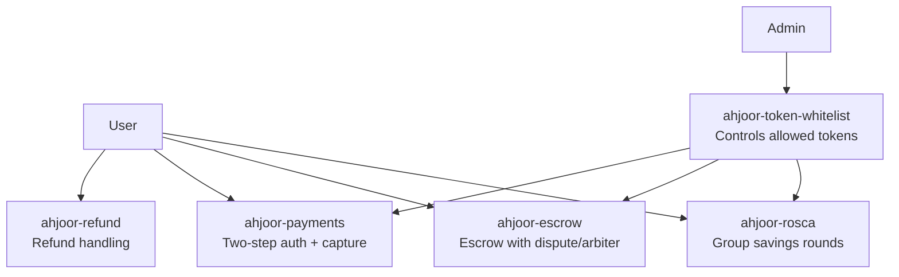

# Ahjoor - Decentralized ROSCA Platform

**Ahjoor** is a decentralized Rotating Savings and Credit Association (ROSCA) platform built on the Stellar blockchain. It empowers communities and savings groups to pool funds and take turns receiving the collective pot with complete transparency, security, and no middlemen.

## Overview

ROSCAs are one of the oldest and most widely used savings systems in the world, yet they still rely entirely on trust and manual processes. Ahjoor brings this tradition on-chain using Stellar's fast, low-cost blockchain infrastructure to provide:

- **Trustless Savings Circles**: Automated round management with no central authority
- **Transparent Operations**: All participants can verify contributions and payouts on-chain
- **Secure Funds**: Cryptographically secured group wallets and contribution records
- **Cost-Effective**: Built on Stellar's efficient, low-fee blockchain infrastructure
- **Scalable**: Designed to support many groups running simultaneously

## Glossary

- **ROSCA** – Rotating Savings and Credit Association: a group where members pool fixed amounts each cycle and one member receives the full pot per round.
- **Ajo** – Nigerian (Yoruba) term for a community savings circle
- **Esusu** – West African community savings circle
- **Susu** – Caribbean / West African savings circle variant
- **Tanda** – Latin American ROSCA
- **Chit Fund** – South Asian, often formalized and legally regulated ROSCA

## Use Cases

- Community savings circles (Ajo, Esusu, Susu, Tanda, Chit Funds)
- Corporate employee savings programs
- Diaspora remittance and group savings
- Micro-lending and credit-building for underbanked communities
- Multi-party escrow and collective fund management

## Quick Start

### Prerequisites

- [Rust](https://www.rust-lang.org/tools/install) (latest stable)
- [Stellar CLI](https://developers.stellar.org/docs/build/smart-contracts/getting-started/setup)
- Make (optional, for convenience commands)

### Installation

```bash
# Fork the repository
# Then clone your fork into your local environment
git clone https://github.com/Ahjoor/ahjoor-contract.git
cd ahjoor-contracts

# Add wasm32 target
rustup target add wasm32-unknown-unknown
```

### Build

```bash
# Using Make
make build
```

OR

```bash
# Using cargo
cargo build --target wasm32-unknown-unknown --release
```

```bash
# Or directly with Stellar CLI
stellar contract build
```

### Test

```bash
# Run all tests
make test
```

### Coverage

```bash
# Install once
cargo install cargo-llvm-cov --locked

# Enforce thresholds (line >= 90%, branch/region >= 85%)
make coverage
```

### Format & Lint

```bash
# Format code
make fmt
```

```bash
# OR
cargo fmt
```

```bash
# Check formatting
make fmt-check
```

```bash
# OR
cargo check --all
```

```bash
# Run clippy lints
make lint
```

### Deploy to Testnet

```bash
# Fund a testnet account
stellar keys generate --global alice --network testnet
stellar keys fund alice --network testnet

# Deploy the contract
stellar contract deploy \
  --wasm target/wasm32-unknown-unknown/release/ahjoor_rosca.wasm \
  --source alice \
  --network testnet

# Verify deployment
stellar contract invoke \
  --id <CONTRACT_ID> \
  --source alice \
  --network testnet \
  -- get_fee_bps
```

> **Note:** The `deploy` command prints a `CONTRACT_ID` — save it immediately, as you'll need it for all subsequent `stellar contract invoke` calls.

## Architecture

Ahjoor is composed of five Soroban smart contracts. The diagram below shows how users, admins, and contracts relate to each other.



### Contract Responsibilities

| Contract                   | Role                                                                           |
| -------------------------- | ------------------------------------------------------------------------------ |
| **ahjoor-rosca**           | Manages rotating savings groups — round lifecycle, contributions, and payouts  |
| **ahjoor-escrow**          | Holds funds in escrow with optional arbiter and dispute/timeout resolution     |
| **ahjoor-payments**        | Two-step authorization and capture flow for merchant-style payments            |
| **ahjoor-refund**          | Handles refund issuance and claim logic for cancelled or reversed transactions |
| **ahjoor-token-whitelist** | Admin-controlled registry of tokens permitted across all other contracts       |

The token whitelist sits at the foundation — `ahjoor-rosca`, `ahjoor-escrow`, and `ahjoor-payments` each consult it before accepting any token transfer, giving admins a single control point for token policy across the platform.

## Security Model

Ahjoor's contracts are designed with defense-in-depth across every interaction:

### Access Control
- Every state-mutating function requires the caller to sign with their Stellar keypair via `require_auth()`. Unauthorized callers are rejected at the SDK level before any logic executes.
- Role-based checks (buyer, seller, arbiter, inspector) are enforced per-function so that, for example, only the designated arbiter can resolve a dispute and only the buyer can release funds.

### Fund Custody
- Funds are held exclusively by the deployed contract address — never by an EOA. Token transfers only occur through explicit, permissioned entry-points (`release`, `refund`, `resolve_dispute`).
- Multi-party seller payouts are split in basis-points (BPS), ensuring the sum always equals 10 000 before any transfer is executed.

### Dispute & Arbitration
- Disputes freeze the escrow, preventing unilateral fund movement by either party.
- A configurable `dispute_timeout_seconds` ensures that an unresponsive arbiter cannot lock funds indefinitely: after the timeout the configured default winner (buyer or seller) can claim.
- The cooling-off window after an arbiter verdict gives the losing party a defined period to review before finalisation.

### Collateral & Slashing
- Optional seller collateral (configured in BPS at creation) is locked until dispute resolution. On a buyer-favour ruling, a configurable `collateral_forfeit_bps` share is slashed as a penalty, deterring bad-faith sellers.
- An `UnderCollateralized` status blocks release if the collateral value drops below the required ratio, protecting buyers in volatile markets.

### Token Whitelist
- All contracts integrate with the `ahjoor-token-whitelist` contract. Only explicitly whitelisted SEP-41 tokens are accepted, preventing interactions with malicious or spoofed token contracts.

### Replay & Overflow Protection
- The Soroban runtime enforces transaction uniqueness; replayed invocations are rejected at the ledger level.
- Rust's `overflow-checks = true` release profile setting (see `Cargo.toml`) causes any arithmetic overflow to panic rather than wrap silently.

### State Archival Safety
- TTL bump logic is called on every write path so that active contract state is never silently archived mid-operation. Callers can also invoke `bump_storage()` manually to extend TTL during periods of low activity.

## Token Whitelist

The `ahjoor-token-whitelist` contract (`contracts/ahjoor-token-whitelist`) restricts which tokens can be used across Ahjoor ROSCA, Escrow, and Payment groups. When a group contract is configured with a whitelist contract address, token operations are rejected unless the token is allowed.

### Who controls it

Only the contract **admin** can modify the whitelist. The admin is set once at deployment via `initialize(admin)`. All write operations require the admin address to authorize the transaction.

### Key functions

| Function | Description |
| --- | --- |
| `add_token(admin, token)` | Add a token contract address to the global whitelist. |
| `remove_token(admin, token)` | Remove a token from the global whitelist. |
| `is_whitelisted(token) → bool` | Return whether a token is on the global whitelist (read-only). |

### Example CLI call

```bash
stellar contract invoke \
  --id <WHITELIST_CONTRACT_ID> \
  --network testnet \
  -- is_whitelisted --token <TOKEN_ADDRESS>
```

## State Archival & TTL

Stellar/Soroban utilizes State Archival to manage network storage footprint. Idle contracts and data entries will eventually be archived. Ahjoor handles state preservation automatically when members interact with it (e.g. `init` or `contribute`). However, if the contract goes unused for a long period, participants should occasionally call the `bump_storage()` function to manually extend the time-to-live (TTL) of the contract's instance storage and avoid sudden state archival.

## Technology Stack

- **Blockchain**: Stellar (Soroban smart contracts)
- **Language**: Rust
- **SDK**: Soroban SDK v21.0.0
- **Token Standard**: SEP-41 / Stellar Asset Contract (XLM or any compatible token)
- **Testing**: Soroban test utilities

## FAQ

**Q: What happens if I miss a contribution round?**

A: You receive a penalty. After `max_defaults` consecutive missed rounds you are suspended from the group.

**Q: Can I pay my contribution in parts?**

A: Yes. The contract supports partial installments — contribute any amount up to the remaining balance and the round tracks your cumulative total.

**Q: What tokens are accepted?**

A: Only tokens on the admin-controlled whitelist (`ahjoor-token-whitelist`). XLM and any SEP-41 compatible token can be whitelisted.

**Q: What is the maximum protocol fee?**

A: 5% (500 basis points), hard-capped and enforced on-chain. Admins cannot set a higher fee.

**Q: What happens if a dispute arbiter goes inactive?**

A: After the configured timeout (default 7 days), anyone can call `enforce_dispute_timeout(escrow_id)` to release funds to the pre-configured default winner.

**Q: How do I prevent my contract state from being archived?**

A: Call `bump_storage()` periodically (recommended every ~30 days of inactivity). If archival does occur, state can be restored via `stellar contract restore`.

## Resources

- [Stellar Documentation](https://developers.stellar.org/)
- [Soroban Smart Contracts](https://soroban.stellar.org/)
- [Stellar CLI Reference](https://developers.stellar.org/docs/tools/developer-tools)

    ## Community

- [Telegram Group Chat](https://t.me/ahjoor)

## Documentation

- [Payments Authorization and Capture Flow](docs/payments-flow.md) - lifecycle guide for `authorize_payment`, `capture_payment`, missed capture expiry, and related events.
- [Contract Error Codes](docs/errors.md) — consolidated reference of every numeric `#[contracterror]` code exposed by the Ahjoor contracts.
